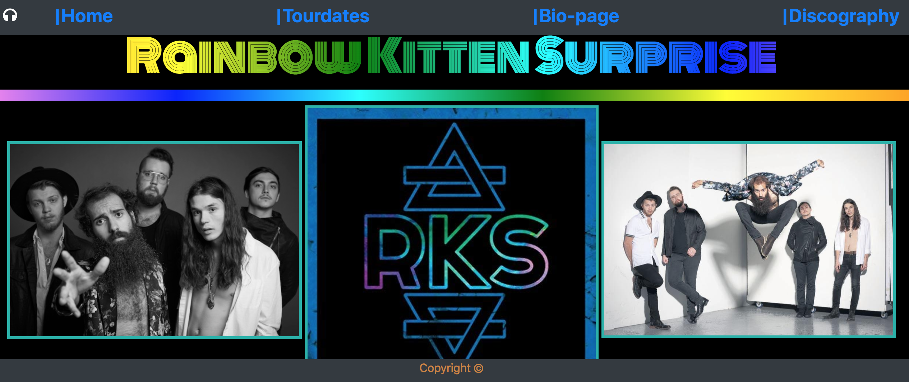

# RainbowKittenSurpriseFanPage
Link to page: https://edwardfarris.github.io/RainbowKittenSurpriseFanPage/

### **Description:**
This was one of my first web pages I created to exercise my knowledge of HTML and CSS. I simply enjoy the band's music and decided to create a fan page for others who may share my musical interests. This was a great opportunity to practice page layout, google fonts, embedding a YouTube video, making an unordered list, arranging and resizing images, etc.   
_____
### **Demo Screenshot**

_________
### **Technologies Used**
* HTML5
* CSS3
_____
### **Built With**
* Visual Studio Code